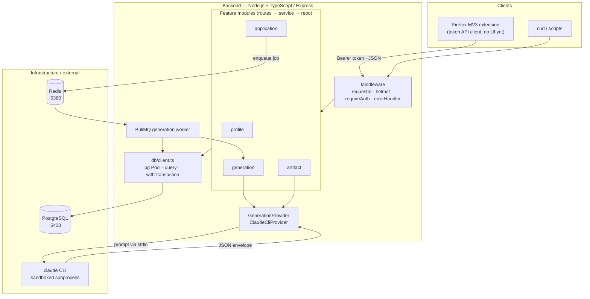
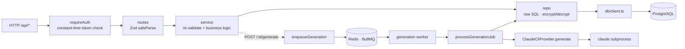
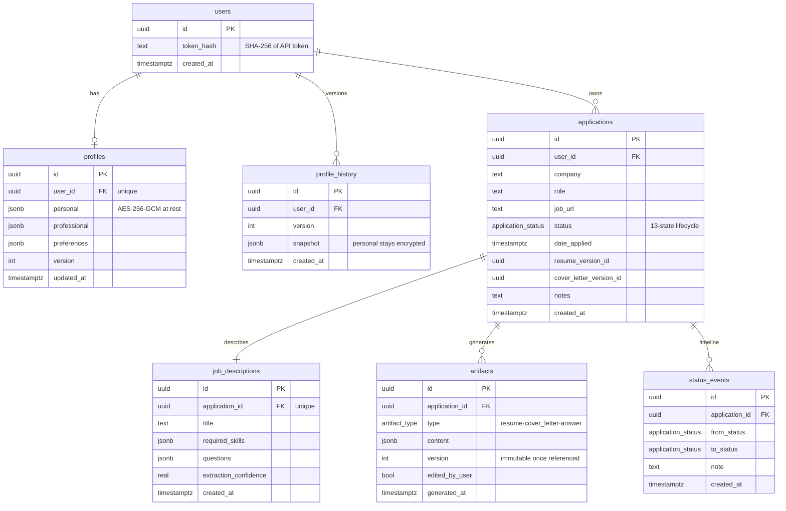
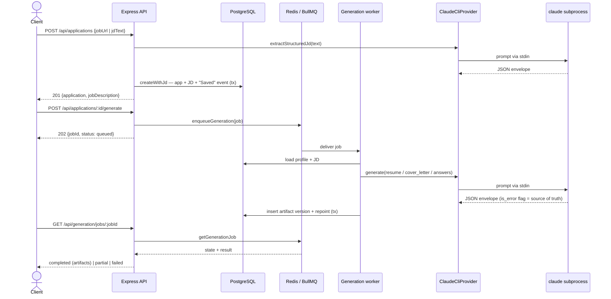

# Project Rotom

AI-assisted job-application Firefox extension + backend. See the PRD for the full
product vision, and [`context/`](./context) for a grounded breakdown of intent vs. the
built state. **This repository implements Phase 0 (Foundations) + Phase 1 (Core Generation MVP).**

## What's built

- **Profile system** — the single source of truth: full CRUD with Zod validation,
  versioning, and append-only history. Personal PII is encrypted at rest. Auth is a
  single-user **API token** (only its SHA-256 hash is stored).
- **JD intake** — create an application from a **URL** (server fetches + strips HTML) or
  **pasted text**; the Claude CLI structures it into fields.
- **Generation** — queued (BullMQ) resume / cover-letter / screening-answer generation,
  grounded in profile + JD with a strict no-fabrication contract; combined "Generate" plus
  per-type regeneration. Per-artifact partial success.
- **Tracking** — auto-recorded applications, list/filter, detail (app + JD + artifacts +
  timeline), and validated status transitions across the 13-state lifecycle.
- **AI layer** — a swappable `GenerationProvider` backed by a sandboxed `claude` subprocess
  (pure text generator, no tools, hard timeout).

Form automation + ATS adapters, the extension UI, match summary, and resume import are
**deferred to later phases** (see [`context/roadmap.md`](./context/roadmap.md)).

## Layout

```
project-rotom/
  docker-compose.yml   # Postgres + Redis for local dev
  backend/             # Node.js + TypeScript service (the focus of Phase 0)
  extension/           # Firefox MV3 scaffold (manifest + API client stub, no UI)
```

## Architecture (HLD)

High-level design of the system as currently built (Phase 0 + Phase 1).

### System context & components



### Request layering & generation pipeline

The per-feature path is **routes → service → repo**; encryption and all SQL live
at the repo boundary. Generation is **asynchronous** via a Redis-backed queue.



### Data model

Single-user model. Nested sub-entities (work experience, education, JD lists,
artifact content) live in **`jsonb` columns** validated by Zod at the boundary —
a deliberate document model. `job_descriptions` also holds `responsibilities`,
`preferred_skills`, `qualifications`, `keywords`, and `form_fields` (jsonb).



### Flow: create application → generate → poll



## Quickstart

```bash
# 1. Infrastructure
docker compose up -d

# 2. Backend
cd backend
cp .env.example .env          # set DATA_ENCRYPTION_KEY (AI layer uses your `claude login`)
node -e "console.log(require('crypto').randomBytes(32).toString('base64'))"  # -> DATA_ENCRYPTION_KEY
npm install
npm run migrate               # apply SQL migrations
npm run dev                   # starts on PORT (default 8787); prints the API token once
```

### Try it

```bash
TOKEN="<the token printed on first boot, or your API_TOKEN>"

curl localhost:8787/healthz
curl -H "Authorization: Bearer $TOKEN" localhost:8787/api/profile
curl -H "Authorization: Bearer $TOKEN" localhost:8787/api/generation/health
```

## Scripts (backend)

| Script | Purpose |
|---|---|
| `npm run dev` | Dev server with reload (tsx) |
| `npm run build` / `npm start` | Compile to `dist/` and run with Node |
| `npm run migrate` | Apply pending migrations |
| `npm run test` | Vitest unit + integration tests (uses the isolated `rotom_test` DB) |
| `npm run lint` / `npm run typecheck` | Static checks |

> Postgres is published on host port **5433** and Redis on **6380** (to avoid
> clashing with native services on the default ports). The `.env.example`
> connection strings already match.

## Requirements

- Node.js ≥ 20.10, Docker (for Postgres + Redis)
- The `claude` CLI on `PATH`, logged in via `claude login` (the AI layer reuses
  that subscription token). Optionally set `ANTHROPIC_API_KEY` to override it.
